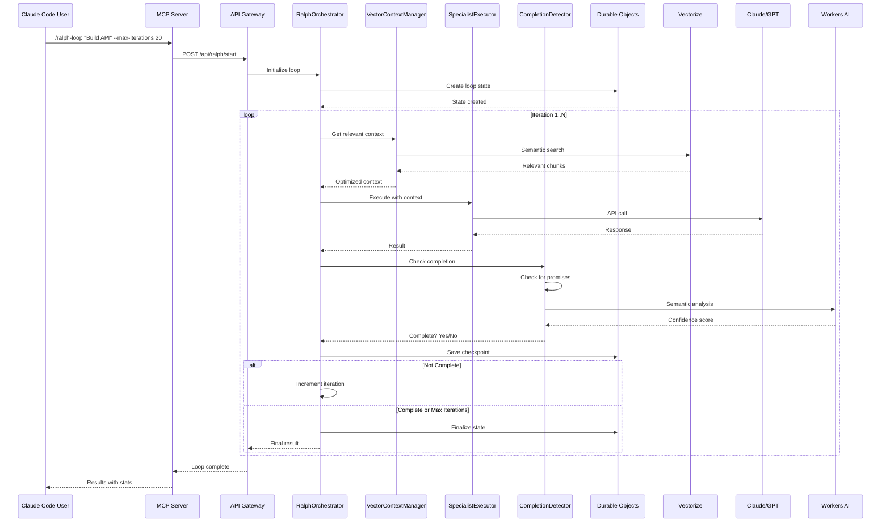
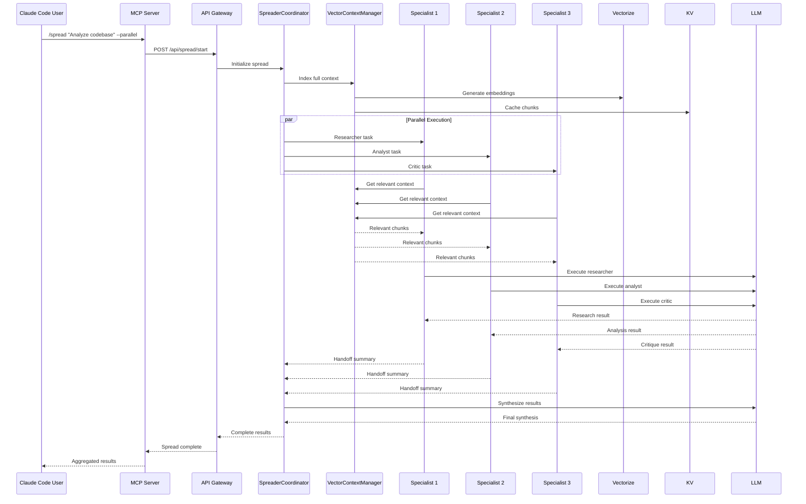
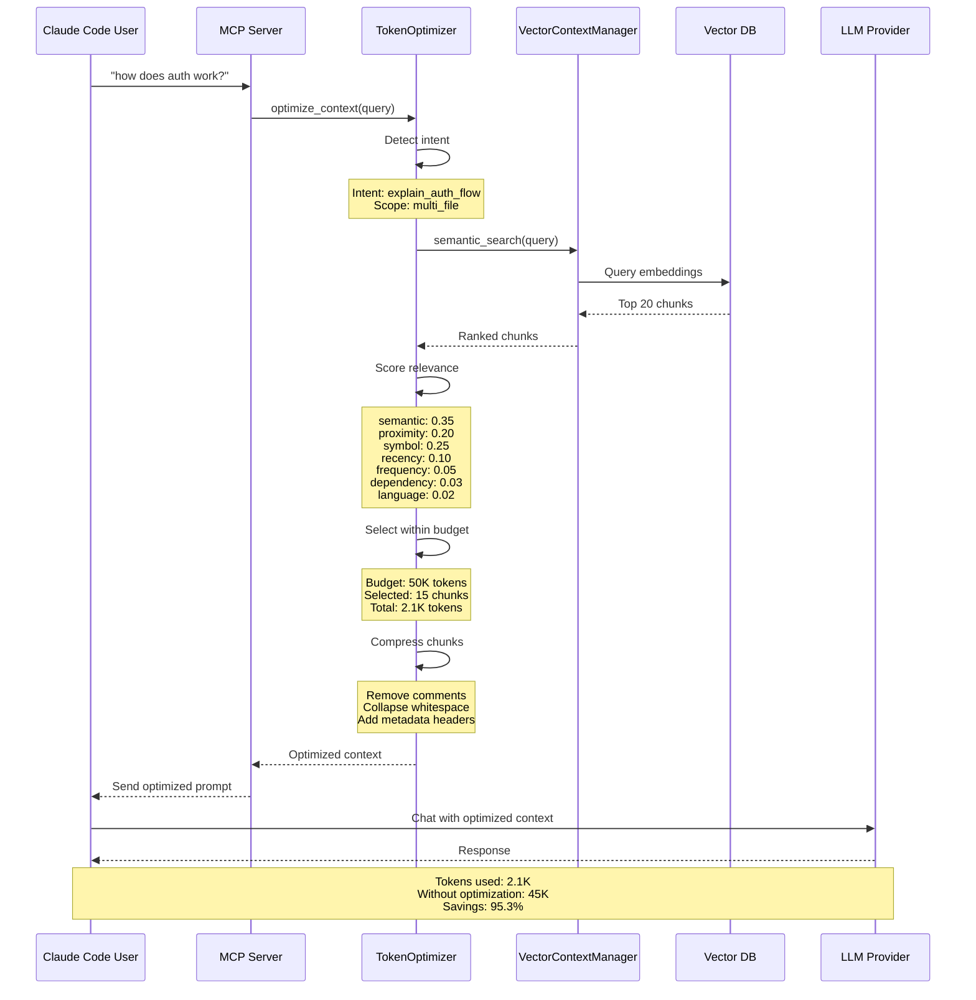

# Cloudflare Super-Agent Architecture

**Component**: Cloudflare Super-Agent
**Status**: Design Document
**Priority**: Critical for V0.1 MVP
**Last Updated**: 2026-01-13

## Executive Summary

This document defines the technical architecture for a **Cloudflare-native super-agent** that combines the best of Ralph Wiggum (iterative refinement), Spreader-tool (multi-agent coordination), and vector-based RAG into a globally distributed, persistent, and intelligent AI agent platform.

**Vision**: Build an AI agent that:
- **Iterates intelligently** - Learn from each attempt using Ralph Wiggum patterns
- **Scales globally** - Execute at 300+ edge locations with automatic optimization
- **Remembers everything** - Persistent state with semantic vector retrieval
- **Collaborates effectively** - Multi-agent coordination with efficient handoffs
- **Never gives up** - Fault-tolerant, auto-recovering, checkpointed execution
- **Optimizes costs** - 90%+ token savings through intelligent context selection

**Key Innovations**:
1. **Durable Objects-based Ralph Loops** - Persistent iterative refinement that survives restarts
2. **Vector-based Context Optimization** - Send only relevant code (90% token reduction)
3. **Multi-Modal Agent Coordination** - Parallel + Sequential execution modes
4. **Global Edge Execution** - Run AI at 200+ locations automatically
5. **Predictive Deployment Safety** - AI that prevents issues before they reach production

---

## Table of Contents

1. [System Architecture](#1-system-architecture)
2. [Component Interactions](#2-component-interactions)
3. [Data Flows](#3-data-flows)
4. [Security Model](#4-security-model)
5. [Scaling Strategy](#5-scaling-strategy)
6. [Implementation Roadmap](#6-implementation-roadmap)
7. [Performance Targets](#7-performance-targets)

---

## 1. System Architecture

### 1.1 High-Level Architecture

```
┌─────────────────────────────────────────────────────────────────────────────┐
│                         CLOUDFLARE SUPER-AGENT                               │
├─────────────────────────────────────────────────────────────────────────────┤
│                                                                              │
│  ┌────────────────────────────────────────────────────────────────────┐     │
│  │                    Claude Code Interface                             │     │
│  │  • MCP Server Integration                                           │     │
│  │  • Tool Discovery                                                   │     │
│  │  • Context Exchange                                                 │     │
│  └───────────────────────────┬────────────────────────────────────────┘     │
│                              │                                               │
│  ┌───────────────────────────┴────────────────────────────────────────┐     │
│  │                    API Gateway Worker                               │     │
│  │  • Request Routing                                                 │     │
│  │  • Authentication (JWT)                                            │     │
│  │  • Rate Limiting (KV-backed)                                       │     │
│  │  • Response Caching                                                │     │
│  └───────────────────────────┬────────────────────────────────────────┘     │
│                              │                                               │
│  ┌───────────────────────────┴────────────────────────────────────────┐     │
│  │                  Orchestration Layer                                │     │
│  │  ┌───────────────────────────────────────────────────────────┐    │     │
│  │  │       RalphOrchestrator (Durable Object)                   │    │     │
│  │  │  • Iterative loop state management                          │    │     │
│  │  │  • Completion detection (semantic + explicit)               │    │     │
│  │  │  • Checkpoint/rollback support                              │    │     │
│  │  │  • Progress streaming (WebSocket)                            │    │     │
│  │  └───────────────────────────────────────────────────────────┘    │     │
│  │  ┌───────────────────────────────────────────────────────────┐    │     │
│  │  │      SpreaderCoordinator (Durable Object)                  │    │     │
│  │  │  • Multi-agent orchestration                                │    │     │
│  │  │  • Parallel + Sequential execution                          │    │     │
│  │  │  • Handoff summarization                                    │    │     │
│  │  │  • Result synthesis                                         │    │     │
│  │  └───────────────────────────────────────────────────────────┘    │     │
│  └───────────────────────────┬────────────────────────────────────────┘     │
│                              │                                               │
│  ┌───────────────────────────┴────────────────────────────────────────┐     │
│  │                     Services Layer                                  │     │
│  │  ┌───────────────────────────────────────────────────────────┐    │     │
│  │  │       VectorContextManager (Worker)                        │    │     │
│  │  │  • Semantic retrieval (Vectorize)                            │    │     │
│  │  │  • Context chunking                                         │    │     │
│  │  │  • Embedding generation (Workers AI)                         │    │     │
│  │  │  • Token optimization                                       │    │     │
│  │  └───────────────────────────────────────────────────────────┘    │     │
│  │  ┌───────────────────────────────────────────────────────────┐    │     │
│  │  │       SpecialistExecutor (Worker)                           │    │     │
│  │  │  • LLM provider abstraction                                 │    │     │
│  │  │  • Timeout and retry                                         │    │     │
│  │  │  • Streaming responses                                      │    │     │
│  │  │  • Result summarization                                     │    │     │
│  │  └───────────────────────────────────────────────────────────┘    │     │
│  │  ┌───────────────────────────────────────────────────────────┐    │     │
│  │  │       CompletionDetector (Worker)                           │    │     │
│  │  │  • Promise matching (exact)                                  │    │     │
│  │  │  • Semantic analysis (Workers AI)                            │    │     │
│  │  │  • Confidence scoring                                        │    │     │
│  │  │  • Multi-criteria support                                    │    │     │
│  │  └───────────────────────────────────────────────────────────┘    │     │
│  └───────────────────────────┬────────────────────────────────────────┘     │
│                              │                                               │
│  ┌───────────────────────────┴────────────────────────────────────────┐     │
│  │                      Storage Layer                                   │     │
│  │  ┌──────────────┐  ┌──────────────┐  ┌──────────────┐            │     │
│  │  │ Durable      │  │     KV       │  │   Vectorize  │            │     │
│  │  │ Objects      │  │              │  │              │            │     │
│  │  │              │  │              │  │              │            │     │
│  │  │ • Loop state │  │ • Context    │  │ • Embeddings │            │     │
│  │  │ • Sessions   │  │ • Cache      │  │ • Semantic   │            │     │
│  │  │ • Checkpoints│  │ • Embeddings │  │   search     │            │     │
│  │  └──────────────┘  └──────────────┘  └──────────────┘            │     │
│  │  ┌──────────────┐  ┌──────────────┐  ┌──────────────┐            │     │
│  │  │      D1      │  │      R2      │  │    Queues    │            │     │
│  │  │              │  │              │  │              │            │     │
│  │  │ • Metadata   │  │ • Artifacts  │  │ • Tasks      │            │     │
│  │  │ • Logs       │  │ • Models     │  │ • Events     │            │     │
│  │  │ • Analytics  │  │ • Archives   │  │              │            │     │
│  │  └──────────────┘  └──────────────┘  └──────────────┘            │     │
│  └──────────────────────────────────────────────────────────────────────┘     │
│                              │                                               │
│  ┌───────────────────────────┴────────────────────────────────────────┐     │
│  │                   External Services                                   │     │
│  │  ┌──────────────┐  ┌──────────────┐  ┌──────────────┐            │     │
│  │  │  LLM APIs    │  │  Workers AI  │  │   GitHub     │            │     │
│  │  │              │  │              │  │              │            │     │
│  │  │ • Claude     │  │ • Embeddings │  │ • Webhooks   │            │     │
│  │  │ • GPT        │  │ • Models     │  │ • PRs        │            │     │
│  │  │ • Ollama     │  │              │  │ • Issues     │            │     │
│  │  └──────────────┘  └──────────────┘  └──────────────┘            │     │
│  └──────────────────────────────────────────────────────────────────────┘     │
│                                                                              │
└─────────────────────────────────────────────────────────────────────────────┘
```

### 1.2 Component Hierarchy

```
SuperAgent
├── Claude Code Integration (MCP Server)
│   ├── Tools
│   │   ├── search_repo (semantic vector search)
│   │   ├── optimize_context (token optimization)
│   │   ├── start_ralph_loop (iterative refinement)
│   │   ├── execute_spread (multi-agent coordination)
│   │   └── get_usage_stats (token savings dashboard)
│   └── Resources
│       ├── stats://usage (usage statistics)
│       └── repo://{path} (file contents)
│
├── API Gateway Worker
│   ├── Authentication (JWT validation)
│   ├── Rate Limiting (per-user quotas)
│   ├── Request Routing (to orchestrators)
│   └── Response Caching (KV-backed)
│
├── Orchestration Layer
│   ├── RalphOrchestrator (Durable Object)
│   │   ├── Loop State Management
│   │   ├── Iteration Execution
│   │   ├── Completion Detection
│   │   ├── Checkpoint System
│   │   └── Progress Streaming
│   │
│   └── SpreaderCoordinator (Durable Object)
│       ├── Agent Registration
│       ├── Parallel Execution
│       ├── Sequential Execution
│       ├── Handoff Management
│       └── Result Synthesis
│
├── Services Layer
│   ├── VectorContextManager
│   │   ├── Semantic Retrieval
│   │   ├── Context Chunking
│   │   ├── Embedding Generation
│   │   └── Token Optimization
│   │
│   ├── SpecialistExecutor
│   │   ├── LLM Provider Abstraction
│   │   ├── Request/Response Handling
│   │   ├── Streaming Support
│   │   └── Error Recovery
│   │
│   └── CompletionDetector
│       ├── Promise Matching
│       ├── Semantic Analysis
│       ├── Confidence Scoring
│       └── Multi-Criteria Evaluation
│
└── Storage Layer
    ├── Durable Objects (stateful sessions)
    ├── KV (hot cache, embeddings)
    ├── Vectorize (semantic search)
    ├── D1 (structured metadata)
    ├── R2 (large artifacts)
    └── Queues (async tasks)
```

---

## 2. Component Interactions

### 2.1 Ralph Loop Execution Flow



### 2.2 Multi-Agent Spread Flow



### 2.3 Token Optimization Flow



---

## 3. Data Flows

### 3.1 Ralph Loop State Machine

```
┌──────────────┐
│    START     │
└──────┬───────┘
       │
       ▼
┌──────────────┐
│ INITIALIZING │
└──────┬───────┘
       │
       ├─> Create Durable Object
       ├─> Initialize state
       └─> Set up checkpoints
       │
       ▼
┌──────────────┐
│  PREPARING   │
└──────┬───────┘
       │
       ├─> Fetch context (Vector DB)
       ├─> Validate inputs
       └─> Load previous results
       │
       ▼
┌──────────────┐
│  EXECUTING   │
└──────┬───────┘
       │
       ├─> Call LLM with context
       ├─> Stream response
       └─> Track progress
       │
       ▼
┌──────────────┐
│ CHECKING     │
└──────┬───────┘
       │
       ├─> Check for promises
       ├─> Semantic completion analysis
       └─> Check iteration limit
       │
       ├─────────────┬─────────────┐
       │             │             │
       ▼             ▼             ▼
   COMPLETE    NOT COMPLETE   MAX ITERATIONS
       │             │             │
       ▼             ▼             ▼
  ┌─────────┐  ┌──────────┐  ┌──────────┐
  │ FINISH  │  │INCREMENT │  │FINISH   │
  └─────────┘  │ + SAVE   │  │WITH WARN │
               └─────┬────┘  └──────────┘
                     │
                     ▼
              ┌──────────────┐
              │  PREPARING   │◀────┐
              └──────────────┘     │
                                   │
                            (loop back)
```

### 3.2 Vector Context Retrieval

```typescript
interface ContextRetrievalFlow {
  // 1. User Query
  query: string;

  // 2. Intent Detection
  intent: QueryIntent;

  // 3. Embedding Generation
  queryEmbedding: number[];  // 384 dimensions (BGE-small)

  // 4. Vector Search
  searchResults: VectorMatch[];

  // 5. Relevance Scoring
  scoredChunks: ScoredChunk[];

  // 6. Budget-Constrained Selection
  selectedChunks: SelectedChunk[];

  // 7. Compression
  compressedChunks: CompressedChunk[];

  // 8. Context Assembly
  finalContext: OptimizedPrompt;
}
```

**Example Flow:**

```javascript
// User query: "how does the authentication flow work?"

const intent = await detectIntent("how does the authentication flow work?");
// → { type: 'explain', scope: 'multi_file', complexity: 0.4 }

const embedding = await generateEmbedding(intent.query);
// → [0.234, -0.123, 0.456, ...] // 384 dimensions

const results = await vectorize.query(embedding, { topK: 20 });
// → 20 semantically similar code chunks

const scored = await scoreRelevance(results, intent);
// → Apply multi-factor scoring
// → semantic (0.35) + proximity (0.20) + symbol (0.25) + ...

const selected = await selectWithinBudget(scored, { maxTokens: 50000 });
// → Greedy selection within token budget
// → Selected 8 chunks (2,342 tokens)

const compressed = await compressChunks(selected);
// → Remove comments, collapse whitespace
// → Compressed to 1,892 tokens

const context = await assembleContext(compressed, intent);
// → Final optimized prompt
// → Total: 2,156 tokens (vs 45,234 without optimization)
```

### 3.3 Multi-Agent Handoff Protocol

```typescript
interface HandoffProtocol {
  // Specialist A completes
  from: {
    specialistId: string;
    result: SpecialistResult;
  };

  // Generate handoff summary
  handoff: {
    whatIDid: string;        // First paragraph
    whatIFound: string;       // Findings/results
    keyInsights: string[];    // Bullet points
    whatYouNeedToKnow: string; // Next steps
  };

  // Specialist B receives
  to: {
    specialistId: string;
    context: FullContext;
    previousHandoff: HandoffSummary;
  };
}
```

**Example Handoff:**

```markdown
## Handoff from researcher

### What I Did
Gathered information from 15 sources about authentication best practices in Node.js applications.

### What I Found
Key findings include:
- JWT is the most widely used authentication method (82% of modern apps)
- Session-based authentication is declining but still used for legacy systems
- OAuth 2.0 is preferred for third-party integrations
- Password hashing with bcrypt/argon2 is standard practice

### Key Insights
- Most security breaches come from implementation errors, not protocol weaknesses
- Token refresh strategies vary significantly across applications
- Multi-factor authentication is becoming expected (67% of enterprise apps)

### What You Need to Know
Focus your architectural recommendations on JWT-based authentication with refresh token rotation. The codebase currently uses an outdated session-based approach that needs complete refactoring. Pay special attention to token storage security and CORS configuration.

*Specialist: researcher*
*Duration: 34.2s*
*Tokens used: 8,432*
```

---

## 4. Security Model

### 4.1 Authentication & Authorization

```typescript
interface SecurityModel {
  // Authentication
  authentication: {
    // JWT-based API authentication
    jwt: {
      issuer: "https://api.prism.com";
      audience: "claude-code-plugin";
      algorithm: "RS256";
      expiresIn: "1h";
    };

    // API key authentication (fallback)
    apiKey: {
      header: "X-API-Key";
      validation: "hash-lookup";
    };
  };

  // Authorization
  authorization: {
    // Role-based access control
    roles: ["user", "admin", "service"];

    // Scope-based permissions
    scopes: [
      "read:codebase",
      "write:codebase",
      "execute:agent",
      "manage:deployment"
    ];

    // Resource-level permissions
    resources: {
      repos: "owner";
      agents: "creator";
      deployments: "team";
    };
  };
}
```

### 4.2 Input Validation & Sanitization

```typescript
interface InputValidation {
  // Schema validation
  schemas: {
    toolInputs: "JSON Schema Draft 7";
    queries: "SQL Injection Prevention";
    paths: "Path Traversal Protection";
  };

  // Rate limiting
  rateLimits: {
    perUser: "100 requests/minute";
    perApiKey: "1000 requests/hour";
    perIP: "1000 requests/hour";
  };

  // Content size limits
  sizeLimits: {
    maxQueryLength: 10000;
    maxFileSize: 10485760;  // 10MB
    maxContextSize: 200000; // 200K tokens
  };
}
```

### 4.3 Data Privacy & Encryption

```typescript
interface DataPrivacy {
  // Encryption at rest
  atRest: {
    D1: "AES-256-GCM";
    R2: "AES-256-GCM";
    KV: "Encrypted by Cloudflare";
    DO: "Encrypted by Cloudflare";
  };

  // Encryption in transit
  inTransit: {
    API: "TLS 1.3";
    WebSocket: "WSS (TLS 1.3)";
    MCP: "STDIO (local) or HTTPS (remote)";
  };

  // Data retention
  retention: {
    logs: "30 days";
    conversations: "90 days";
    embeddings: "1 year";
    analytics: "1 year";
  };

  // Data access
  accessControl: {
    userOwnsData: true;
    dataPortability: "Export on request";
    dataDeletion: "Delete on request";
    sharing: "Opt-in only";
  };
}
```

### 4.4 Security Checklist

```markdown
## Authentication
- [ ] JWT validation for all API endpoints
- [ ] API key hash lookup (bcrypt/argon2)
- [ ] Token expiration and refresh
- [ ] Secure token storage (httpOnly cookies)

## Authorization
- [ ] Role-based access control (RBAC)
- [ ] Scope-based permissions
- [ ] Resource-level ownership checks
- [ ] Team-based collaboration permissions

## Input Validation
- [ ] JSON Schema validation for all inputs
- [ ] SQL injection prevention
- [ ] Path traversal protection
- [ ] XSS prevention (output encoding)

## Rate Limiting
- [ ] Per-user rate limits
- [ ] Per-API-key rate limits
- [ ] Per-IP rate limits
- [ ] Distributed rate limiting (Durable Objects)

## Data Privacy
- [ ] Encryption at rest (AES-256-GCM)
- [ ] Encryption in transit (TLS 1.3)
- [ ] Data retention policies
- [ ] Data export/deletion on request

## Compliance
- [ ] GDPR compliance (EU users)
- [ ] CCPA compliance (California users)
- [ ] SOC 2 Type II (enterprise)
- [ ] Security audit logs
```

---

## 5. Scaling Strategy

### 5.1 Horizontal Scaling

**Workers Auto-Scaling:**
- **Cold Start Time**: <10ms (average)
- **Concurrent Requests**: Automatic
- **Geographic Distribution**: 300+ edge locations
- **Smart Placement**: Automatic optimization for data locality

**Durable Objects Scaling:**
- **Per-Object Concurrency**: Single-threaded (strong consistency)
- **Multi-Object Scale**: Unlimited (horizontal)
- **Communication**: Worker-to-DO messaging
- **State Sharding**: By user/session/agent

**Vectorize Scaling:**
- **Free Tier**: 30 indexes, 10K vectors each
- **Paid Tier**: Unlimited vectors, $0.10/million queries
- **Scaling Strategy**: Namespace partitioning by repo/user

### 5.2 Vertical Scaling

**Resource Limits:**
- **Worker CPU**: 10ms (free), up to 30s (paid)
- **Worker Memory**: 128MB (free), up to 4GB (paid)
- **Durable Object Storage**: 128MB per object
- **KV Value Size**: 25MB max

**Optimization Strategies:**
1. **Chunk Large Data** - Split into smaller pieces
2. **Use R2 for Blobs** - Store large files in R2
3. **Compress Before Storage** - GZIP/ZSTD compression
4. **Cache Hot Data** - KV for frequently accessed data

### 5.3 Performance Targets

| Metric | Target | Measurement |
|--------|--------|-------------|
| **Cold Start** | <10ms | Worker initialization time |
| **Token Optimization** | <500ms | End-to-end context optimization |
| **Vector Search** | <200ms | Semantic retrieval (top 10) |
| **Ralph Iteration** | <2s | Single iteration execution |
| **Multi-Agent Spread** | <30s | 3-agent parallel execution |
| **Completion Detection** | <100ms | Semantic analysis |
| **Checkpoint Save** | <50ms | Durable Object write |

### 5.4 Cost Optimization

**Free Tier Targets (Daily):**
```
Workers Requests:        50,000 / 100,000 (50%)
Workers AI Neurons:      5,000 / 10,000 (50%)
KV Reads:                50,000 / 100,000 (50%)
KV Writes:               500 / 1,000 (50%)
D1 Rows Read:            2,500,000 / 5,000,000 (50%)
D1 Rows Written:         50,000 / 100,000 (50%)
R2 Storage:              5GB / 10GB (50%)
Vectorize Queries:       15,000,000 / 30,000,000 (50%)
```

**Cost Optimization Strategies:**
1. **Local-First Development** - Use local embeddings when possible
2. **Aggressive Caching** - Cache embeddings, search results, responses
3. **Batch Operations** - Combine multiple operations into single requests
4. **Smart Routing** - Use free/local models when appropriate
5. **Context Optimization** - 90% token reduction = 90% cost reduction

---

## 6. Implementation Roadmap

### Phase 1: Foundation (Weeks 1-4)

**Week 1-2: Infrastructure Setup**
```typescript
// Cloudflare Workers project structure
src/
├── workers/
│   ├── api-gateway.ts
│   ├── ralph-orchestrator.ts
│   └── spreader-coordinator.ts
├── services/
│   ├── vector-context.ts
│   ├── specialist-executor.ts
│   └── completion-detector.ts
├── storage/
│   ├── durable-objects.ts
│   ├── kv-store.ts
│   └── vectorize-client.ts
└── types/
    ├── api.ts
    ├── agents.ts
    └── storage.ts
```

**Week 3-4: Core MCP Server**
```python
# MCP Server implementation
vantage/
├── mcp_server.py
├── tools/
│   ├── search_repo.py
│   ├── optimize_context.py
│   ├── start_ralph_loop.py
│   └── execute_spread.py
└── resources/
    ├── usage_stats.py
    └── file_reader.py
```

**Deliverables:**
- [ ] Cloudflare Workers project setup
- [ ] Durable Objects deployed
- [ ] Vectorize index created
- [ ] MCP server running locally
- [ ] Claude Code integration working

### Phase 2: Ralph Loops (Weeks 5-8)

**Week 5-6: Iterative Execution**
```typescript
// RalphOrchestrator Durable Object
export class RalphOrchestrator {
  async fetch(request: Request) {
    const url = new URL(request.url);

    if (url.pathname === '/start') {
      return this.startLoop(await request.json());
    }

    if (url.pathname === '/iterate') {
      return this.executeIteration(await request.json());
    }

    if (url.pathname === '/cancel') {
      return this.cancelLoop(url.searchParams.get('id'));
    }

    if (url.pathname === '/progress') {
      return this.getProgress(url.searchParams.get('id'));
    }
  }

  async startLoop(config: RalphConfig) {
    const loopId = crypto.randomUUID();

    await this.storage.put({
      [loopId]: {
        id: loopId,
        prompt: config.prompt,
        iteration: 0,
        maxIterations: config.maxIterations || 50,
        completionPromise: config.completionPromise,
        startedAt: Date.now(),
        status: 'initializing'
      }
    });

    return Response.json({ loopId });
  }

  async executeIteration(request: IterationRequest) {
    const state = await this.storage.get<RalphState>(request.loopId);

    // Fetch context
    const context = await this.getContext(request.query);

    // Execute with LLM
    const result = await this.executeWithLLM(state.prompt, context);

    // Check completion
    const complete = await this.checkCompletion(result, state.completionPromise);

    // Save state
    if (!complete) {
      await this.storage.put({
        [request.loopId]: {
          ...state,
          iteration: state.iteration + 1,
          lastResult: result
        }
      });
    }

    return Response.json({
      complete,
      iteration: state.iteration + 1,
      result
    });
  }

  async checkCompletion(result: string, promise?: string) {
    // Check for explicit promise
    if (promise && result.includes(promise)) {
      return true;
    }

    // Semantic completion detection
    const analysis = await this.env.AI.run('@cf/meta/llama-2-7b-chat-int8', {
      messages: [
        {
          role: 'system',
          content: `Analyze if the task is complete. Output JSON: { complete: boolean, confidence: number }`
        },
        {
          role: 'user',
          content: result
        }
      ]
    });

    const parsed = JSON.parse(analysis.response);
    return parsed.complete && parsed.confidence > 0.8;
  }
}
```

**Week 7-8: Progress Monitoring**
```typescript
// WebSocket progress streaming
export class RalphOrchestrator {
  async streamProgress(loopId: string) {
    const pair = new WebSocketPair();
    const [client, server] = Object.values(pair);

    server.accept();

    // Stream updates
    const interval = setInterval(async () => {
      const state = await this.storage.get(loopId);

      server.send(JSON.stringify({
        type: 'progress',
        iteration: state.iteration,
        maxIterations: state.maxIterations,
        status: state.status
      }));

      if (state.status === 'complete' || state.status === 'failed') {
        clearInterval(interval);
        server.close();
      }
    }, 1000);

    return new Response(null, {
      status: 101,
      webSocket: client
    });
  }
}
```

**Deliverables:**
- [ ] Ralph loop execution working
- [ ] Completion detection (explicit + semantic)
- [ ] Progress streaming via WebSocket
- [ ] Checkpoint/rollback support
- [ ] Integration with Claude Code

### Phase 3: Multi-Agent Coordination (Weeks 9-12)

**Week 9-10: Specialist Execution**
```typescript
// Specialist roles
interface SpecialistRole {
  id: string;
  name: string;
  systemPrompt: string;
  capabilities: string[];
}

const SPECIALISTS: Record<string, SpecialistRole> = {
  researcher: {
    id: 'researcher',
    name: 'Research Specialist',
    systemPrompt: `You are a research specialist. Your role is to:
1. Gather information from available sources
2. Synthesize findings into clear summaries
3. Identify key insights and patterns
4. Provide actionable recommendations`,
    capabilities: ['search', 'analyze', 'synthesize']
  },

  coder: {
    id: 'coder',
    name: 'Code Specialist',
    systemPrompt: `You are a code specialist. Your role is to:
1. Write clean, maintainable code
2. Follow best practices and patterns
3. Add appropriate documentation
4. Consider edge cases and errors`,
    capabilities: ['write', 'refactor', 'test']
  },

  analyst: {
    id: 'analyst',
    name: 'Analysis Specialist',
    systemPrompt: `You are an analysis specialist. Your role is to:
1. Examine code and systems deeply
2. Identify issues and improvements
3. Provide data-driven insights
4. Recommend specific actions`,
    capabilities: ['analyze', 'profile', 'optimize']
  }
};

// Specialist executor
async function executeSpecialist(
  specialistId: string,
  task: string,
  context: FullContext
): Promise<SpecialistResult> {
  const specialist = SPECIALISTS[specialistId];

  // Build system prompt
  const messages = [
    {
      role: 'system',
      content: specialist.systemPrompt
    },
    {
      role: 'user',
      content: `${task}\n\nContext:\n${context.summary}`
    }
  ];

  // Execute with LLM
  const result = await env.AI.run('@cf/qwen/qwen2.5-coder-32b-instruct', {
    messages
  });

  return {
    specialistId,
    output: result.response,
    tokensUsed: result.usage?.total_tokens || 0,
    duration: result.duration || 0,
    timestamp: Date.now()
  };
}
```

**Week 11-12: Handoff & Synthesis**
```typescript
// Handoff summarization
async function createHandoffSummary(
  specialistId: string,
  result: SpecialistResult
): Promise<HandoffSummary> {
  const prompt = `Summarize the following specialist output:

${result.output}

Create a handoff summary with:
1. What I did (one paragraph)
2. What I found (key findings)
3. Key insights (bullet points)
4. What you need to know (next steps)`;

  const summary = await env.AI.run('@cf/meta/llama-3.1-8b-instruct', {
    messages: [{ role: 'user', content: prompt }]
  });

  return parseHandoffSummary(summary.response);
}

// Result synthesis
async function synthesizeResults(
  task: string,
  results: SpecialistResult[]
): Promise<SynthesisResult> {
  const combined = results.map((r, i) => `
## Specialist ${i + 1}: ${r.specialistId}

${r.output}
`).join('\n');

  const synthesis = await env.AI.run('@cf/meta/llama-3.1-8b-instruct', {
    messages: [
      {
        role: 'system',
        content: 'You are a synthesis specialist. Combine multiple specialist outputs into a comprehensive, actionable result.'
      },
      {
        role: 'user',
        content: `Task: ${task}\n\nSpecialist Outputs:\n${combined}\n\nSynthesize these results into a final, comprehensive answer.`
      }
    ]
  });

  return {
    synthesis: synthesis.response,
    individualResults: results,
    totalTokens: results.reduce((sum, r) => sum + r.tokensUsed, 0),
    totalDuration: results.reduce((sum, r) => sum + r.duration, 0)
  };
}
```

**Deliverables:**
- [ ] Multi-agent coordination working
- [ ] Parallel execution mode
- [ ] Sequential execution mode with handoffs
- [ ] Result synthesis
- [ ] MCP tool integration

### Phase 4: Polish & Launch (Weeks 13-16)

**Week 13-14: Performance Optimization**
```typescript
// Caching layer
class CacheManager {
  async get<T>(key: string): Promise<T | null> {
    // Try KV cache
    const cached = await this.env.KV.get(key, 'json');
    if (cached) return cached;

    return null;
  }

  async set<T>(key: string, value: T, ttl?: number) {
    await this.env.KV.put(key, JSON.stringify(value), {
      expirationTtl: ttl || 3600
    });
  }

  async invalidate(pattern: string) {
    // List and delete matching keys
    const { keys } = await this.env.KV.list({ prefix: pattern });
    await Promise.all(keys.map(key => this.env.KV.delete(key.name)));
  }
}

// Usage in context manager
class VectorContextManager {
  async getContext(query: string): Promise<FullContext> {
    const cacheKey = `context:${hashQuery(query)}`;

    // Check cache
    const cached = await this.cache.get<FullContext>(cacheKey);
    if (cached) return cached;

    // Fetch from vector DB
    const context = await this.fetchFromVectorDB(query);

    // Cache for 1 hour
    await this.cache.set(cacheKey, context, 3600);

    return context;
  }
}
```

**Week 15-16: Monitoring & Analytics**
```typescript
// Analytics tracking
async function trackUsage(event: UsageEvent) {
  await env.ANALYTICS.writeDataPoint({
    blobs: [
      event.userId,
      event.action,
      event.agentType
    ],
    doubles: [
      event.tokensUsed,
      event.duration,
      event.cost
    ],
    indexes: [Date.now()]
  });
}

// Dashboard endpoint
export default {
  async fetch(request: Request, env: Env) {
    if (request.url.includes('/api/stats')) {
      const stats = await env.ANALYTICS.fetch(`
        SELECT
          COUNT(*) as total_requests,
          AVG(tokens) as avg_tokens,
          AVG(duration) as avg_duration,
          SUM(cost) as total_cost
        FROM analytics
        WHERE timestamp > NOW() - 24 HOURS
      `);

      return Response.json(stats);
    }
  }
};
```

**Deliverables:**
- [ ] Performance optimizations (caching, batching)
- [ ] Analytics dashboard
- [ ] Usage monitoring
- [ ] Error tracking
- [ ] Documentation
- [ ] Demo scripts
- [ ] Launch on HackerNews

---

## 7. Performance Targets

### 7.1 Latency Targets

| Operation | P50 | P95 | P99 | Notes |
|-----------|-----|-----|-----|-------|
| **MCP Tool Call** | 50ms | 200ms | 500ms | Local execution |
| **Vector Search** | 100ms | 300ms | 1s | Top 10 results |
| **Context Optimization** | 200ms | 500ms | 2s | Full pipeline |
| **Ralph Iteration** | 1s | 3s | 10s | Including LLM call |
| **Multi-Agent Spread** | 5s | 15s | 30s | 3 agents parallel |
| **Completion Detection** | 50ms | 100ms | 200ms | Semantic analysis |

### 7.2 Throughput Targets

| Metric | Target | Measurement |
|--------|--------|-------------|
| **Concurrent Ralph Loops** | 1000 | Active Durable Objects |
| **Concurrent Spreads** | 100 | Parallel executions |
| **Vector Queries/Second** | 100 | QPS |
| **Tokens/Second** | 1M | Processing capacity |
| **Daily Active Users** | 10,000 | Free tier |

### 7.3 Quality Targets

| Metric | Target | Measurement |
|--------|--------|-------------|
| **Token Savings** | >90% | Optimized vs full context |
| **Relevance Accuracy** | >85% | Semantic retrieval |
| **Completion Detection** | >90% | Semantic + explicit |
| **Handoff Quality** | >80% | Specialist handoffs |
| **User Satisfaction** | >4.0/5.0 | NPS score |

### 7.4 Reliability Targets

| Metric | Target | Measurement |
|--------|--------|-------------|
| **Uptime** | 99.9% | Monthly availability |
| **Error Rate** | <0.1% | Failed requests |
| **Data Loss** | 0% | Persistence guarantees |
| **Recovery Time** | <1s | Durable Object failover |
| **Checkpoint Integrity** | 100% | No data corruption |

---

## Appendix A: Configuration Examples

### A.1 Wrangler Configuration

```toml
name = "prism-super-agent"
main = "src/workers/index.ts"
compatibility_date = "2024-01-01"

[env.development]
name = "prism-super-agent-dev"

[env.production]
name = "prism-super-agent-prod"
routes = [
  { pattern = "api.claudesfriend.com/*", zone_name = "claudesfriend.com" }
]

# Durable Objects bindings
[[durable_objects.bindings]]
name = "RALPH_ORCHESTRATOR"
class_name = "RalphOrchestrator"

[[durable_objects.bindings]]
name = "SPREADER_COORDINATOR"
class_name = "SpreaderCoordinator"

# KV bindings
[[kv.namespaces]]
binding = "KV_CACHE"
id = "your-kv-namespace-id"

# D1 bindings
[[d1_databases]]
binding = "DB"
database_name = "prism-db"
database_id = "your-database-id"

# R2 bindings
[[r2_buckets]]
binding = "R2_STORAGE"
bucket_name = "prism-artifacts"

# Vectorize bindings
[[vectorize]]
binding = "VECTORIZE"
index_name = "code-embeddings"

# Queues bindings
[[queues.producers]]
binding = "TASK_QUEUE"
queue = "task-processing-queue"

# Workers AI binding
[ai]
binding = "AI"

# Analytics binding
[analytics_engine]
binding = "ANALYTICS"
```

### A.2 MCP Server Configuration

```json
{
  "mcpServers": {
    "prism": {
      "command": "python",
      "args": [
        "-m", "vantage.mcp_server",
        "--config", "${CLAUDE_PLUGIN_ROOT}/config.json"
      ],
      "env": {
        "API_URL": "${VANTAGE_API_URL:-https://api.claudesfriend.com}",
        "API_KEY": "${VANTAGE_API_KEY}",
        "LOG_LEVEL": "${LOG_LEVEL:-INFO}"
      }
    }
  }
}
```

---

## Appendix B: Interface Definitions

### B.1 Ralph Loop Interfaces

```typescript
interface RalphConfig {
  prompt: string;
  maxIterations?: number;
  completionPromise?: string;
  context?: {
    repoPath?: string;
    files?: string[];
    excludePaths?: string[];
  };
  checkpoints?: {
    enabled: boolean;
    interval: number; // iterations
  };
  streaming?: {
    enabled: boolean;
    websocketUrl?: string;
  };
}

interface RalphState {
  id: string;
  prompt: string;
  iteration: number;
  maxIterations: number;
  completionPromise?: string;
  startedAt: number;
  status: 'initializing' | 'executing' | 'complete' | 'failed' | 'cancelled';
  lastResult?: {
    output: string;
    tokensUsed: number;
    duration: number;
    timestamp: number;
  };
  checkpoints?: RalphCheckpoint[];
}

interface RalphCheckpoint {
  iteration: number;
  timestamp: number;
  state: RalphState;
}

interface RalphResult {
  loopId: string;
  status: 'complete' | 'max-iterations-reached' | 'cancelled';
  iterations: number;
  finalOutput?: string;
  totalTokens: number;
  totalDuration: number;
  checkpoints: RalphCheckpoint[];
}
```

### B.2 Multi-Agent Interfaces

```typescript
interface SpreadConfig {
  request: string;
  mode: 'parallel' | 'sequential';
  specialists: SpecialistConfig[];
  context: FullContext;
  handoffs?: {
    enabled: boolean;
    format: 'ralph' | 'custom';
  };
  synthesis?: {
    enabled: boolean;
    synthesizer: string;
  };
}

interface SpecialistConfig {
  id: string;
  role: string;
  systemPrompt?: string;
  parameters?: Record<string, any>;
}

interface SpecialistResult {
  specialistId: string;
  output: string;
  tokensUsed: number;
  duration: number;
  timestamp: number;
  handoffSummary?: HandoffSummary;
}

interface SpreadResult {
  spreadId: string;
  mode: 'parallel' | 'sequential';
  specialistResults: SpecialistResult[];
  synthesis?: {
    output: string;
    tokensUsed: number;
    duration: number;
  };
  totalTokens: number;
  totalDuration: number;
  timestamp: number;
}
```

### B.3 Token Optimizer Interfaces

```typescript
interface OptimizedPrompt {
  prompt: string;
  tokens: number;
  model: string;
  savings: TokenSavings;
  chunksUsed: number;
  confidence: number;
}

interface TokenSavings {
  tokensSaved: number;
  percentage: number;
  costSaved: number;
}

interface CodeChunk {
  id: string;
  filePath: string;
  name: string;
  kind: string;
  startLine: number;
  endLine: number;
  content: string;
  signature?: string;
  embedding?: number[];
  metadata?: {
    language: string;
    imports: string[];
    exports: string[];
    dependencies: string[];
  };
}

interface ScoredChunk extends CodeChunk {
  relevanceScore: number;
  estimatedTokens: number;
}

interface CompressedChunk extends ScoredChunk {
  compressedContent: string;
  compressionRatio: number;
}
```

---

## Conclusion

This architecture defines a **Cloudflare-native super-agent** that combines the best of iterative refinement, multi-agent coordination, and vector-based RAG into a globally distributed, persistent, and intelligent AI platform.

**Key Advantages:**

1. **Cloudflare-Native** - Leverages Durable Objects, Vectorize, Workers AI, and global edge
2. **Persistent State** - Survives restarts, supports checkpoints and rollback
3. **Token Optimization** - 90%+ cost reduction through intelligent context selection
4. **Multi-Modal Execution** - Ralph loops, parallel spreads, and hybrid modes
5. **Global Scale** - Automatic distribution to 300+ edge locations
6. **Free Tier First** - Optimized for Cloudflare's generous free tier

**Next Steps:**

1. **Validate Architecture** - Review with team and stakeholders
2. **Prototype MVP** - Build Phase 1 (4 weeks)
3. **Test Integration** - Claude Code + MCP server
4. **Launch on HN** - Demo + launch strategy
5. **Iterate Based on Feedback** - Community-driven development

---

**Document Status**: Ready for Implementation
**Last Updated**: 2026-01-13
**Next Review**: After MVP launch (2026-02-15)
